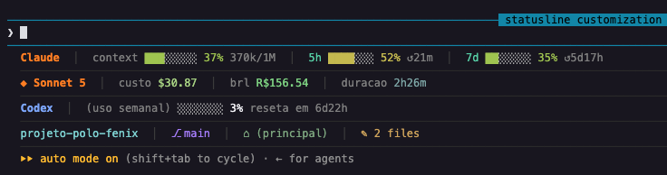

# claude-setup

Minha configuração pessoal do [Claude Code](https://claude.com/claude-code) — CLAUDE.md global, statusline custom, skills próprias, e a stack de plugins de terceiro que uso todo dia.

Testado com Claude Code **2.1.221+**. O `statusline.mjs` lê campos do stdin (`rate_limits`, `cost.total_duration_ms`) que são relativamente recentes — em versão bem mais antiga alguns campos podem faltar, o script já trata isso com fallback `—` em vez de quebrar.

## O que tem aqui

| Caminho | O que é |
|---|---|
| `CLAUDE.md` | Regras globais, aplicadas em todo projeto (`~/.claude/CLAUDE.md`) |
| `RTK.md` | Doc do [RTK](#rtk---rust-token-killer), importado pelo CLAUDE.md via `@RTK.md` |
| `statusline/statusline.mjs` | Script Node do statusline (ver abaixo) |
| `settings.example.json` | Trecho representativo do `~/.claude/settings.json` — hooks, plugins, prefs |
| `skills/` | Minhas skills próprias — ver [seção abaixo](#skills-próprias) |
| `install.sh` | Symlinka tudo isso pro `~/.claude` de uma máquina nova |

## install.sh

Em vez de copiar arquivo por arquivo numa máquina nova, `./install.sh` symlinka `CLAUDE.md`, `RTK.md`, `statusline/statusline.mjs` e cada pasta em `skills/` pra dentro do `~/.claude` real. Symlink em vez de cópia porque um `git pull` neste repo já atualiza tudo instalado, sem reinstalar nada. Não sobrescreve arquivo real que já exista (só symlink solto), e não mexe em plugins de terceiro (RTK, superpowers, caveman, impeccable) — esses têm instalação própria, ver seções abaixo.

```bash
git clone https://github.com/will-pagane/claude-setup.git
cd claude-setup
./install.sh              # tudo
./install.sh --skills     # só as skills, pula CLAUDE.md/statusline
```

## Filosofia (do CLAUDE.md)

Os pontos que mais mudam como trabalho com o Claude:

- **Thought partner, não gerador de código** — questiona requisito fraco, aponta lacuna (form sem validação? API sem auth?) antes de escrever.
- **Nunca commit/PR/merge sem pedido explícito** — estado terminal de uma sessão é "branch pushed, trabalho descrito", não um PR aberto.
- **CLI oficial > MCP** para Supabase e GitHub — motivo real: as write tools do MCP do Supabase carimbam a própria versão de ledger de migration, o que desincroniza o repo do banco.
- **Branch/worktree nomeados por sessão + timestamp** (`<tipo>/<slug>-<AAAAMMDD>`) — nunca aceitar nome aleatório gerado por ferramenta (tipo `claude/magical-jones-8c99`), pra sessões concorrentes ficarem legíveis.
- **Decisão pendente é prosa com trade-off**, nunca um menu A/B/C/D.

## Statusline

3 linhas (Node puro, zero dependência) — as duas primeiras fixas, a terceira em rodízio:



```
Claude │ context ████░░░░ 42% 420k/1M │ 5h ███░░░░ 29% ↺2h │ 7d ███░░░░ 30% ↺5d
────────────────────────────────────────────────────
◆ Opus 4.8 │ custo $2.91 - R$14.76 │ ⏱ 7m ativo / 12m total
────────────────────────────────────────────────────
tokens 542k (480k + 62k sub-agentes) │ 🔥🔥🔥 1.8x ritmo · 50k tok/min │ (4/4)
────────────────────────────────────────────────────
```

(o mesmo espaço da linha 3 alterna, a cada `refreshInterval`, entre Codex, git e o bloco de tokens/ritmo acima — ou porta do dev server quando há um rodando)

- Barra de contexto/5h/7d com **gradiente verde→amarelo→vermelho** em degraus de 10% (truecolor).
- **Linha 3 é um rodízio**, não fixa: alterna entre até 4 candidatos — Codex (uso semanal), git (repo·branch·worktree·files), porta do dev server (só entra se houver um rodando) e o bloco de tokens/ritmo de burn. A troca é por relógio de parede (`Date.now()` dividido pelo intervalo), não por contador de render — por isso o `statusLine.refreshInterval` no `settings.json` **é obrigatório** pra rotação funcionar direito: sem ele, o script só re-roda em eventos (mensagem nova, `/compact`, etc.) e **trava sem trocar** durante um turno longo com vários tool calls seguidos, já que nenhum evento novo dispara nesse meio tempo. `settings.example.json` já inclui `"refreshInterval": 15`.
- **Tokens** conta só o que representa gasto real: `input + output + cache_creation`, **sem** `cache_read_input_tokens` — cache lido de novo a cada turno da sessão inteira incha o total pra milhões sem refletir trabalho novo (é ~10% do preço normal). Soma o transcript da sessão **+** todo sub-agente disparado a partir dela (Task/Agent tool, Workflows — ficam em `<sessionDir>/<sessionId>/subagents/**/*.jsonl`).
- **Ritmo de burn (🔥)** compara tokens-novos-por-minuto-ativo desta sessão contra a média histórica das suas próprias sessões (log local `.burn-log-v2.jsonl`, precisa de 3+ sessões históricas de 1min+ ativo pra ter baseline — sem isso, o segmento some em vez de arriscar leitura errada). Degraus enviesados pra baixo: sessão no ritmo normal fica 0-1 fogo (❄ se mais barata que o costume), só sessão genuinamente mais cara que o costume sobe fogo.
- Linha do **Codex** lê o `rate_limits` direto do rollout `.jsonl` mais recente em `~/.codex/sessions/`, cacheado 60s. **Opcional** — sem o Codex CLI instalado (sem `~/.codex/sessions/`), a linha aparece mesmo assim, só mostra "sem dados" em vez de quebrar.
- **Custo em BRL** ao lado do USD nativo — cotação via [open.er-api.com](https://www.exchangerate-api.com/docs/free) (sem chave), cache de 12h em disco, fallback fixo se offline.
- Candidatos de Codex/git/porta **só entram no rodízio dentro de um repo** (`git rev-parse --is-inside-work-tree`) — fora de um checkout, a linha 3 mostra só o bloco de tokens/ritmo (quando houver dado) ou some.
- **Porta do dev server** detecta perguntando ao SO qual processo `node` escutando TCP tem `cwd` exatamente igual ao toplevel deste checkout (principal ou worktree) e linha de comando contendo `vite` (evita falso-positivo com outro processo node solto na mesma pasta). Sem dev server rodando ali, esse candidato nem entra no rodízio.

## RTK - Rust Token Killer

CLI que filtra saída de `git`/`bash` antes de voltar pro contexto do Claude — corta até 90% do texto ruidoso (logs de git, output verboso de build). Um hook `PreToolUse` reescreve todo `Bash` transparente pra passar por ele. Ver `RTK.md`.

Instalar: `brew install rtk` ([rtk-ai.app](https://www.rtk-ai.app/), Apache-2.0).

## Skills próprias

Autorais ou modificadas por mim o suficiente pra valer vendorizar aqui direto (não são um link pra repo alheio):

| Skill | Pra quê |
|---|---|
| `session-build` | Pega specs escritas numa sessão e leva até shipped: implementa, testa, abre PR |
| `session-end` | Fecha uma branch pronta: verifica, aplica migration, faz deploy, registra pendências, abre PR, merge e limpa branch/worktree |
| `session-handoff` | Gera um prompt único e autocontido pra continuar a sessão em outra janela/agente |
| `code-ultragraph-review` | Review de codebase inteiro via grafo de conhecimento (graphify) — modo `--autopilot` roda pipeline autônomo: lê sinais do Supabase, aplica fix, verifica, abre PR |
| `codex-review` | Loop adversarial Claude↔Codex revisando um plano de implementação antes de escrever código — modifiquei a versão original pro meu fluxo |

## Plugins e skills de terceiro que uso

Instalados via marketplace, cada um no seu próprio repo — listo pra quem quiser instalar as mesmas, não vendorizo (repo já mantém isso atualizado, e evita duplicar licença/atribuição de terceiro):

| Nome | Pra quê | Fonte | Instalar |
|---|---|---|---|
| `superpowers` | Brainstorming, TDD, debugging sistemático, code review — o processo por trás de toda tarefa | plugin oficial, [anthropics/claude-plugins-official](https://github.com/anthropics/claude-plugins-official) | `/plugin marketplace add anthropics/claude-plugins-official` depois `/plugin install superpowers` |
| `caveman` | Modo de resposta ultra-comprimido (~75% menos token), mantendo precisão técnica | [JuliusBrussee/caveman](https://github.com/JuliusBrussee/caveman) | `/plugin marketplace add JuliusBrussee/caveman` depois `/plugin install caveman` |
| `impeccable` | Design/crítica de UI, sistema de design | [pbakaus/impeccable](https://github.com/pbakaus/impeccable) | `/plugin marketplace add pbakaus/impeccable` depois `/plugin install impeccable` |
| `graphify` | Transforma qualquer pasta (código, docs, PDF, imagem, vídeo) num grafo de conhecimento navegável — base do `code-ultragraph-review` acima | [Graphify-Labs/graphify](https://github.com/Graphify-Labs/graphify) | `uv tool install graphifyy` (ou `pipx install graphifyy`) depois `graphify install` |

## O que ainda quero adicionar

- GIF do statusline em ação
- Seção sobre o modo caveman (por quê, quando vale, quando desliga)
